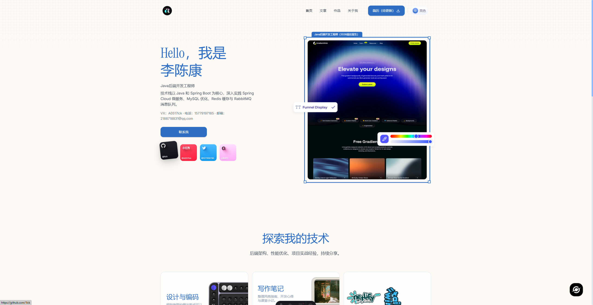
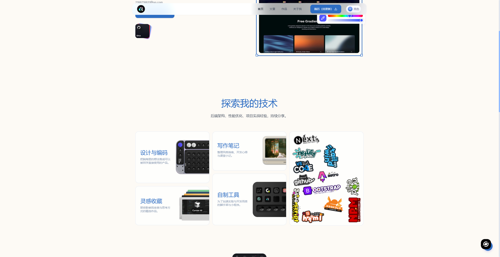
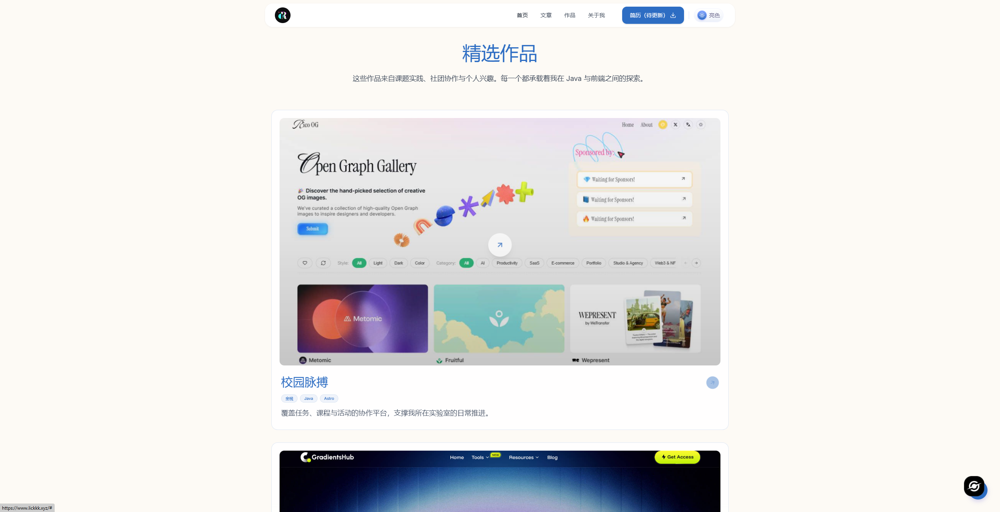
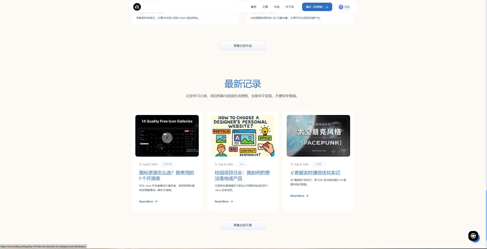
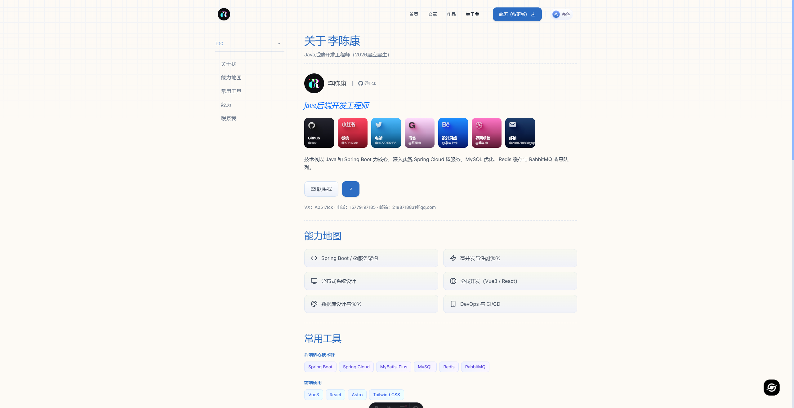
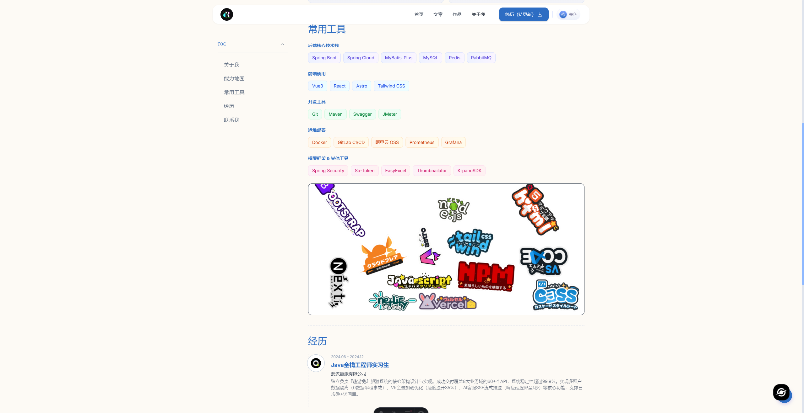
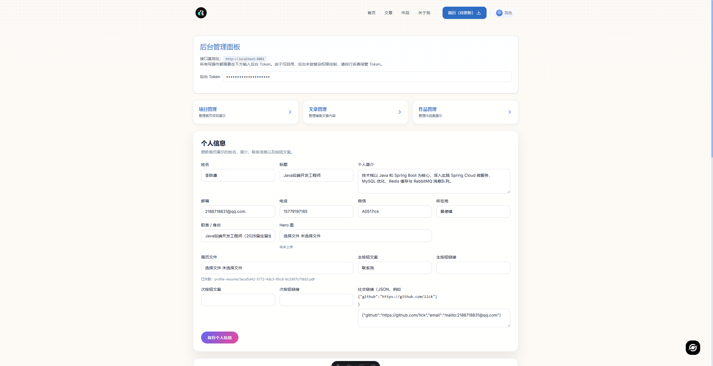
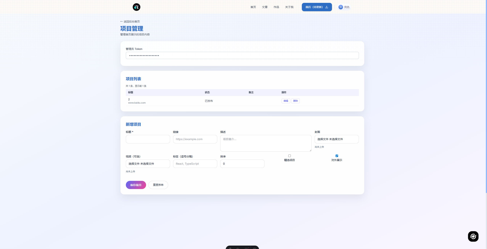
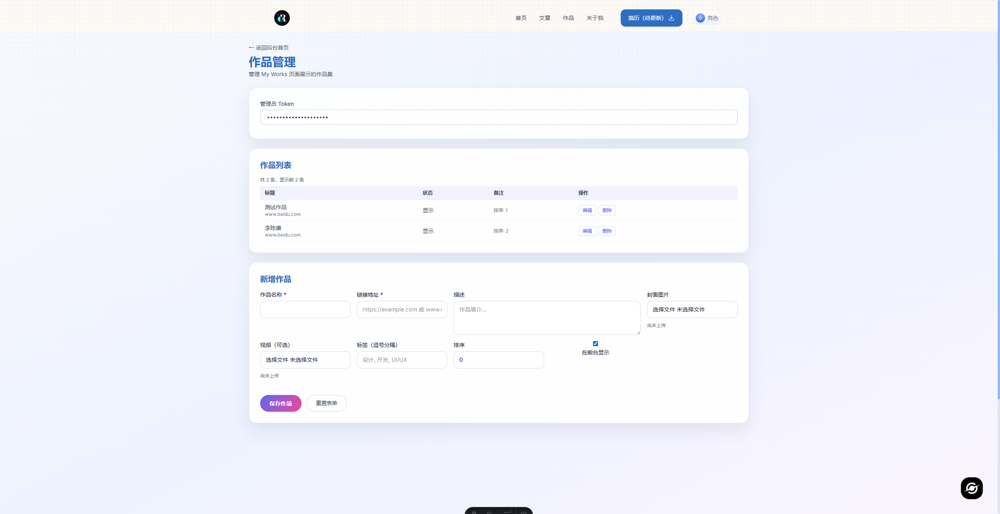

# 李陈康 · 个人作品集网站

> 一个现代化的全栈个人作品集网站，采用前后端分离架构，专为技术人员打造的展示平台。

[](https://astro.build)
[](https://spring.io/projects/spring-boot)
[](https://tailwindcss.com)
[](LICENSE)

## 📝 项目简介

这是一个基于 **Astro** + **Tailwind CSS** + **Spring Boot** 打造的全栈个人作品集网站。项目采用前后端分离架构，前端使用现代化的 Astro 框架结合 Tailwind CSS 实现优雅的 UI 设计和流畅的用户体验，后端基于 Spring Boot 3 构建 RESTful API，使用轻量级的 SQLite 数据库存储数据，无需复杂的数据库配置即可快速部署。

项目的核心亮点在于其完善的**内容管理系统**，提供了独立的管理后台，支持在线管理个人信息、技术博客、项目作品等内容，无需修改代码即可更新网站内容。同时，网站具备完整的 SEO 优化、响应式设计、暗色模式支持等特性，适合作为个人技术博客、作品集展示、求职简历网站使用。

无论你是正在求职的应届生，还是希望建立个人技术品牌的开发者，这个项目都能为你提供一个专业、美观且易于维护的在线展示平台。项目采用 MIT 协议开源，可自由修改和部署。

## ✨ 功能特性

### 📸 页面预览

#### 🎯 前端展示页面

<table>
  <tr>
    <td width="50%">
      <b>首页</b><br>
      
    </td>
    <td width="50%">
      <b>关于页面</b><br>
      
    </td>
  </tr>
  <tr>
    <td width="50%">
      <b>博客页面</b><br>
      
    </td>
    <td width="50%">
      <b>作品展示</b><br>
      
    </td>
  </tr>
  <tr>
    <td width="50%">
      <b>文章详情</b><br>
      
    </td>
    <td width="50%">
      <b>响应式设计</b><br>
      
    </td>
  </tr>
</table>

#### 🛠️ 后台管理页面

<table>
  <tr>
    <td width="33%">
      <b>管理后台主页</b><br>
      
    </td>
    <td width="33%">
      <b>内容管理</b><br>
      
    </td>
    <td width="33%">
      <b>编辑界面</b><br>
      
    </td>
  </tr>
</table>

### 🎨 前端特性
- **现代化设计**：基于 Astro + Tailwind CSS 构建，响应式设计，支持暗色模式
- **动态内容**：通过 REST API 实时获取数据，内容更新无需重新构建
- **流畅动画**：使用 AOS（Animate On Scroll）实现丰富的滚动动画效果
- **SEO 优化**：完整的 meta 标签、sitemap、RSS 支持
- **博客系统**：支持 Markdown 写作，自动生成目录，代码高亮
- **作品展示**：项目卡片展示，支持封面图、视频预览

### ⚙️ 后端特性
- **轻量级后台**：基于 Spring Boot 3，使用 SQLite 数据库，无需复杂配置
- **文件管理**：本地文件系统存储，支持图片、PDF 等文件上传
- **RESTful API**：标准化的 API 接口设计
- **安全认证**：基于 Token 的简单认证机制
- **CORS 配置**：灵活的跨域资源共享配置

### 📊 管理后台
- **个人信息管理**：姓名、简介、联系方式、社交链接等
- **项目管理**：独立的项目管理页面，支持增删改查
- **博客管理**：文章发布、编辑、删除，支持 Markdown
- **作品管理**：作品集展示内容管理
- **文件上传**：支持图片、文档等文件上传，自动返回访问路径

## 📁 目录结构
```
ricoui-portfolio-main/
├── backend/                      # Spring Boot 后端
│   ├── src/main/java/
│   │   └── dev/lichenkang/portfolio/
│   │       ├── controller/       # REST API 控制器
│   │       ├── entity/           # JPA 实体类
│   │       ├── repository/       # 数据访问层
│   │       ├── service/          # 业务逻辑层
│   │       ├── request/          # 请求 DTO
│   │       └── converter/        # 数据转换器
│   ├── src/main/resources/
│   │   └── application.yml       # Spring Boot 配置
│   └── pom.xml                   # Maven 依赖配置
│
├── src/                          # Astro 前端
│   ├── components/               # 可复用组件
│   │   ├── cards/                # 卡片组件
│   │   ├── elements/             # 基础元素
│   │   ├── home/                 # 首页组件
│   │   ├── sections/             # 页面区块
│   │   ├── ui/                   # UI 组件
│   │   └── widgets/              # 小部件
│   ├── layouts/                  # 页面布局
│   ├── pages/                    # 页面路由
│   │   ├── admin/                # 后台管理页面
│   │   │   ├── index.astro       # 主后台页
│   │   │   ├── projects.astro    # 项目管理
│   │   │   ├── posts.astro       # 文章管理
│   │   │   └── works.astro       # 作品管理
│   │   ├── blog/                 # 博客页面
│   │   ├── works/                # 作品页面
│   │   ├── about.astro           # 关于我
│   │   └── index.astro           # 首页
│   ├── scripts/                  # 前端脚本
│   │   └── admin-dashboard.ts   # 后台管理逻辑
│   ├── lib/                      # 工具库
│   │   └── apiClient.ts          # API 客户端
│   ├── collections/              # 静态数据集合
│   │   ├── experiences.json      # 工作经历
│   │   └── social.json           # 社交链接
│   └── config/                   # 配置文件
│       └── site.ts               # 站点配置
│
├── public/                       # 静态资源
│   └── assets/                   # 图片、字体等
│
├── storage/                      # 运行时生成（已忽略）
│   ├── data/                     # SQLite 数据库文件
│   └── media/                    # 上传的媒体文件
│
├── .env                          # 环境变量配置
├── astro.config.mjs              # Astro 配置
├── tailwind.config.mjs           # Tailwind CSS 配置
└── package.json                  # Node.js 依赖
```

## 🔧 技术栈

### 前端
- **框架**：Astro 4.0 - 现代化静态站点生成器
- **样式**：Tailwind CSS 3.x - 实用优先的 CSS 框架
- **动画**：AOS (Animate On Scroll) - 滚动动画库
- **图标**：Lucide Icons - 美观的图标库
- **语言**：TypeScript - 类型安全的 JavaScript

### 后端
- **框架**：Spring Boot 3.x - Java 企业级框架
- **数据库**：SQLite - 轻量级文件数据库
- **ORM**：Spring Data JPA + Hibernate - 对象关系映射
- **构建工具**：Maven - 项目管理和构建工具
- **语言**：Java 21 - 最新 LTS 版本

## ⚙️ 环境要求

- **Node.js**: 18.x 或更高版本
- **Java**: 21 或更高版本
- **Maven**: 3.8+ （或使用项目自带的 mvnw）
- **pnpm**: 推荐使用 pnpm 作为包管理器

## 🚀 快速开始

### 1. 克隆项目

```bash
git clone <your-repo-url>
cd ricoui-portfolio-main
```

### 2. 配置环境变量

复制环境变量示例文件并修改：

```bash
cp .env.example .env
```

编辑 `.env` 文件：

```bash
# 站点 URL（开发环境使用 localhost）
PUBLIC_SITE_URL=http://localhost:5200

# 后端 API 地址
PUBLIC_API_BASE_URL=http://localhost:8081
PUBLIC_MEDIA_BASE_URL=http://localhost:8081/api/files

# 可选：Google Analytics 4
PUBLIC_GA4_ID=

# 可选：Umami 统计
PUBLIC_UMAMI_ID=
```

### 3. 后端配置

后端配置通过环境变量控制（`backend/src/main/resources/application.yml`）：

| 环境变量 | 说明 | 默认值 |
|---------|------|--------|
| `PORT` | 后端服务端口 | `8080` |
| `CONTENT_DATA_PATH` | SQLite 数据库文件路径 | `storage/data` |
| `CONTENT_STORAGE_ROOT` | 媒体文件存储路径 | `storage/media` |
| `CONTENT_MEDIA_BASE_URL` | 媒体文件访问 URL | `http://localhost:8080/api/files` |
| `CONTENT_ADMIN_TOKEN` | 后台管理 Token | `my-secret-token-2024` ⚠️ **必须修改** |
| `PUBLIC_APP_ORIGIN` | 允许的前端域名（CORS） | `http://localhost:5200` |

> **⚠️ 安全提示**：生产环境务必修改 `CONTENT_ADMIN_TOKEN` 为强密码！

### 4. 安装依赖

#### 前端依赖

```bash
# 使用 pnpm （推荐）
pnpm install

# 或使用 npm
npm install
```

#### 后端依赖

```bash
cd backend
mvn clean install
```

### 5. 启动开发服务器

#### 启动后端

```bash
cd backend
mvn spring-boot:run
```

后端服务将在 `http://localhost:8081` 启动，并自动创建 `storage/` 目录。

#### 启动前端

在新的终端窗口中：

```bash
pnpm dev
```

前端服务将在 `http://localhost:5200` 启动。

### 6. 访问应用

- **首页**: http://localhost:5200
- **关于页面**: http://localhost:5200/about
- **博客**: http://localhost:5200/blog
- **管理后台**: http://localhost:5200/admin（需要 Token 认证）

## 📦 构建和部署

### 前端构建

```bash
# 生产环境构建
pnpm build

# 本地预览构建结果
pnpm preview
```

构建产物位于 `dist/` 目录。

### 后端构建

```bash
cd backend
mvn clean package -DskipTests
```

生成的 JAR 文件位于 `backend/target/portfolio-backend-0.0.1-SNAPSHOT.jar`。

### 生产环境运行

```bash
# 运行后端
java -jar backend/target/portfolio-backend-0.0.1-SNAPSHOT.jar

# 运行前端（使用 Node 适配器）
node dist/server/entry.mjs
```

## 🔐 后台管理使用

### 访问后台

1. 打开浏览器访问：`http://localhost:5200/admin`
2. 在"后台 Token"输入框中填入配置的 `CONTENT_ADMIN_TOKEN`
3. 点击"保存 Token"按钮

### 功能说明

#### 1. 个人信息管理

在主后台页面可以管理：
- **基本信息**：姓名、标题、职位描述
- **个人简介**：多段文字介绍（支持换行）
- **联系方式**：邮箱、电话、微信、所在地
- **按钮配置**：主/次按钮的文案和链接
- **社交链接**：JSON 格式的社交媒体链接
- **媒体文件**：头像图片、简历文件等

示例 socialLinks JSON：
```json
{
  "github": "https://github.com/1lck",
  "email": "mailto:2188718831@qq.com"
}
```

#### 2. 项目管理（/admin/projects）

独立的项目管理页面，支持：
- 添加、编辑、删除项目
- 设置项目标题、描述、技术栈
- 上传项目封面图片
- 设置项目链接和 GitHub 仓库
- 控制项目发布状态和展示顺序

#### 3. 文章管理（/admin/posts）

博客文章管理功能：
- 创建、编辑、删除文章
- 支持 Markdown 格式
- 自动生成文章摘要
- 设置文章分类和标签
- 控制发布状态

#### 4. 作品管理（/admin/works）

作品集管理：
- 添加作品展示
- 支持图片/视频封面
- 设置作品描述和链接
- 控制展示顺序

#### 5. 文件上传

在主后台页面的"文件上传"区域：
- 支持上传图片（JPG、PNG、GIF等）
- 支持上传文档（PDF等）
- 可选填写分类（projects、posts、profile、works）
- 上传成功后返回文件路径，可直接复制使用

> **提示**：后台为自用设计，提供基础功能。如需更多权限控制，可在 Spring Boot 层扩展。

## 🚀 生产环境部署

### 部署架构建议

推荐使用 Nginx 作为反向代理：

```nginx
server {
    listen 80;
    server_name your-domain.com;
    
    # 前端静态文件
    location / {
        proxy_pass http://localhost:5200;
        proxy_set_header Host $host;
    }
    
    # 后端 API
    location /api/ {
        proxy_pass http://localhost:8081;
        proxy_set_header Host $host;
        proxy_set_header X-Real-IP $remote_addr;
        client_max_body_size 50M;
    }
}
```

### 环境变量配置

生产环境需要修改以下配置：

#### 前端 (.env)
```bash
PUBLIC_SITE_URL=https://your-domain.com
PUBLIC_API_BASE_URL=https://your-domain.com/api
PUBLIC_MEDIA_BASE_URL=https://your-domain.com/api/files
```

#### 后端（环境变量）
```bash
PORT=8081
CONTENT_DATA_PATH=/var/www/portfolio/data
CONTENT_STORAGE_ROOT=/var/www/portfolio/media
CONTENT_MEDIA_BASE_URL=https://your-domain.com/api/files
CONTENT_ADMIN_TOKEN=your-strong-password-here
PUBLIC_APP_ORIGIN=https://your-domain.com
```

### 部署检查清单

- [ ] 修改所有 localhost 为实际域名
- [ ] 更换强密码的 `CONTENT_ADMIN_TOKEN`
- [ ] 配置 HTTPS 证书（推荐使用 Let's Encrypt）
- [ ] 确保 `storage/` 目录有写入权限
- [ ] 配置防火墙开放必要端口
- [ ] 设置定时备份数据库和媒体文件
- [ ] 配置进程守护（systemd 或 PM2）

### 数据备份

建议每天自动备份：

```bash
#!/bin/bash
DATE=$(date +%Y%m%d)
# 备份数据库
cp /var/www/portfolio/data/portfolio.db /backup/portfolio-$DATE.db
# 备份媒体文件
tar -czf /backup/media-$DATE.tar.gz /var/www/portfolio/media/
```

## 📝 许可证

MIT License

## 🤝 贡献

欢迎提交 Issue 和 Pull Request！

## 📧 联系方式

- 邮箱：2188718831@qq.com
- VX:A0517lck
- GitHub：[@1lck](https://github.com/1lck)
- 前端页面来源：https://github.com/ricocc/ricoui-portfolio

---

⭐ 如果这个项目对你有帮助，欢迎给个 Star！
