I'm Li Chenkang, a computer science student from Jinggangshan who majors in Java full-stack development. Over the last two years I kept hearing the same question from classmates: “你到底都做了些什么？” so I decided to document the products I've shipped for myself, for my university, and for the communities I learn with. None of these are client jobs—they're experiments born from daily needs, curiosity, and the joy of building.

Below is a personal inventory of the tools that currently run my workflow.

## 1. CampusPulse — 校园协作平台

Website: [campuspulse.lichenkang.dev](https://campuspulse.lichenkang.dev)

CampusPulse started because we needed a single source of truth for hackathon prep, lab research, and club onboarding. It's a Spring Boot + PostgreSQL backend with Astro UI that bundles task boards, event timelines, permissioned docs, and notification digests. The entire stack is tuned for fellow students: simple SSO, mobile-first UI, and opinionated flows for semester planning.

Key modules include:

- Kanban, calendar, and stand-up modes powered by the same dataset
- Automated report generator that exports to Markdown/Notion for advisors
- Insight dashboard combining GitHub, Feishu, and IoT lab sensors via cron jobs
- Theme editor so each organization can apply its own branding in seconds

The platform now handles every demo day we host, and it has become the first project we ask new members to extend.

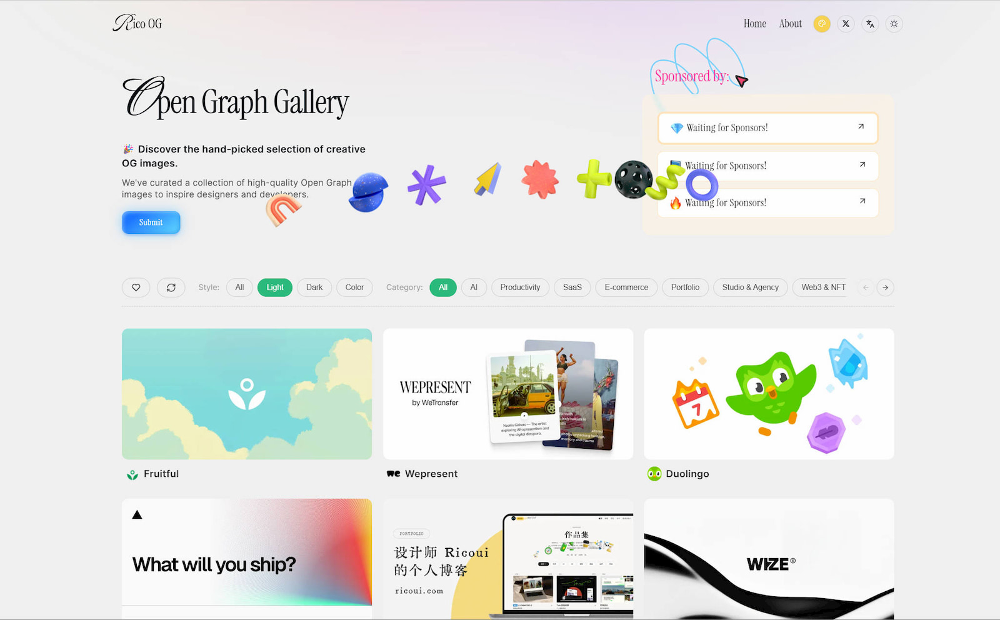

---

## 2. DataCanvas — 渐变可视化工具集

One-stop gradient lab: [datacanvas.lichenkang.dev](https://datacanvas.lichenkang.dev/)

DataCanvas is my playground for turning gradient studies into practical tooling. It ships curated gradient backgrounds, AI-generated motifs, and half a dozen utilities ranging from CSS text gradients to multi-stop palette builders. I use it to prototype dashboards for research teams, but it's equally helpful to designers experimenting with bold palettes.

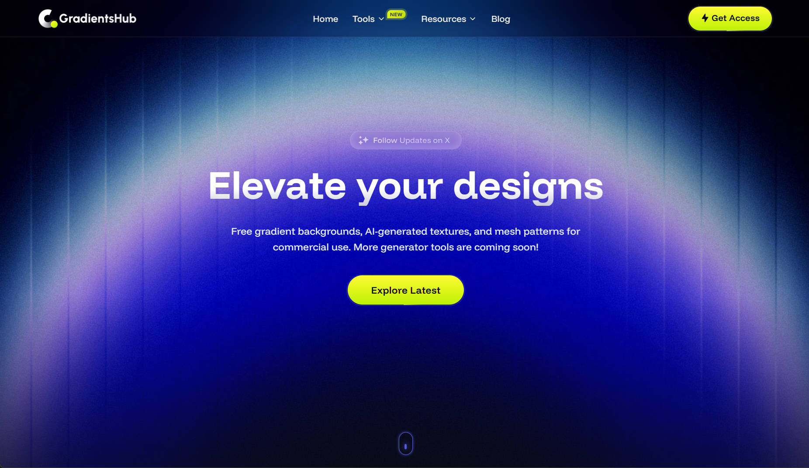

Free gradients ready to drop into decks or hero sections:

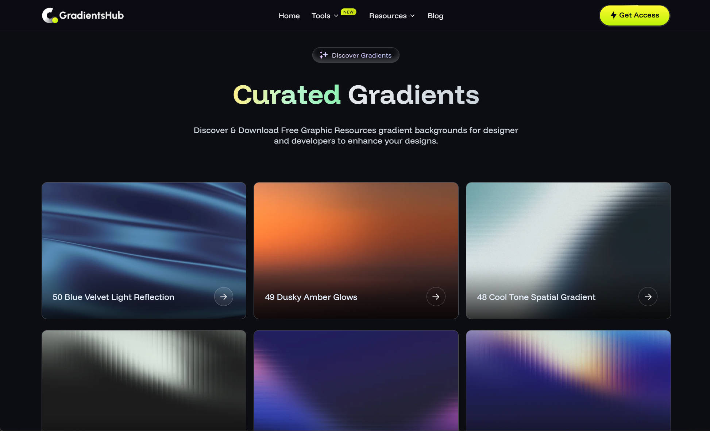

Text gradient generator for hero typography:

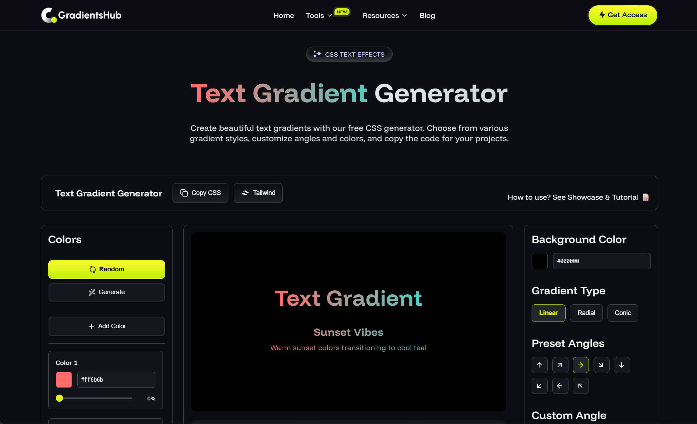

Multi-color background editor with instant CSS export:

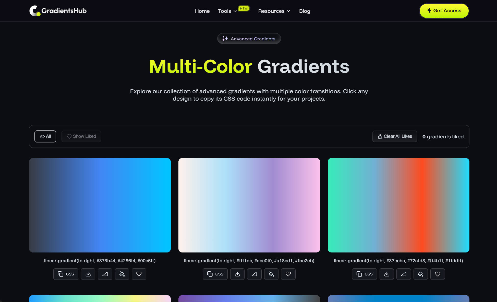

Palette generator that outputs CSS variables and tokens:

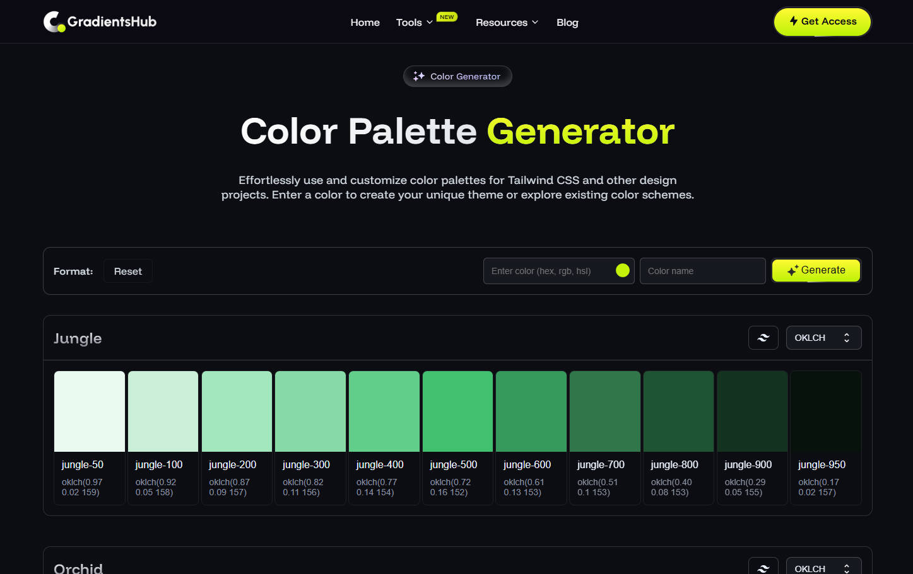

The site runs on Astro with a worker that crunches palette math in Rust. Everything is open sourced so other students can spin up their own themed libraries.

---

## 3. Cosmos Archive — 网页灵感库

Website: [cosmos.lichenkang.dev](https://cosmos.lichenkang.dev)

I collect a lot of web storytelling references, but my bookmarks were chaos. Cosmos Archive fixes that. It's a curated inspiration vault with more than 200 entries tagged by layout, motion, and narrative patterns. I built it on top of a simple Mkdirs template, added metadata ingestion, and layered on screenshot automation so every entry stays fresh.

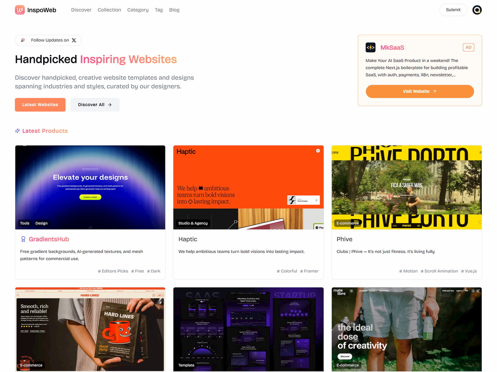

Each site gets category tags, interaction notes, and capture dates:

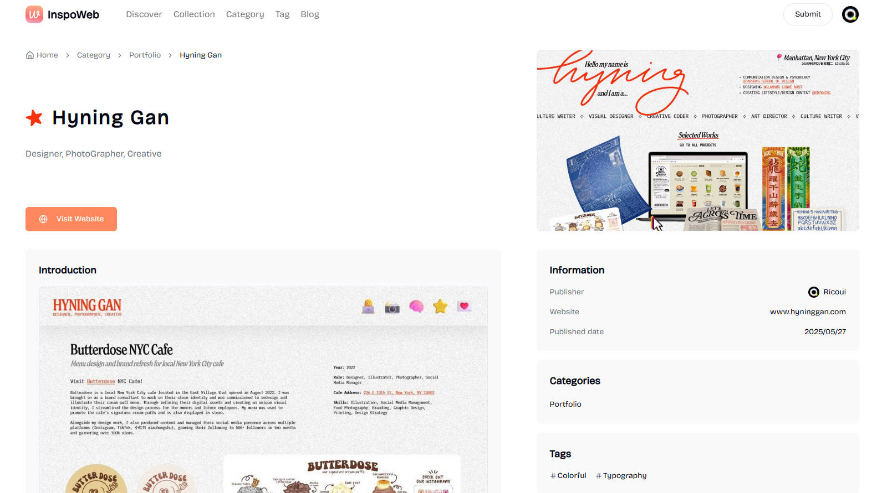

Whenever a teammate hits a creative wall, we open Cosmos Archive together and swipe through saved interactions. It's the closest thing I have to my own museum.

---

## 4. DevKit Deck — 设计开发资源站

Website: [toolkit.lichenkang.dev](https://toolkit.lichenkang.dev/)

DevKit Deck is a navigation site that organizes the tools I reach for daily—Design system references, API playgrounds, marketing checklists, even study plans. Everything passes through my own curation workflow so it's never just a directory dump. The interface supports filtering by task, difficulty, and platform, so juniors in our lab can discover the right resources faster.

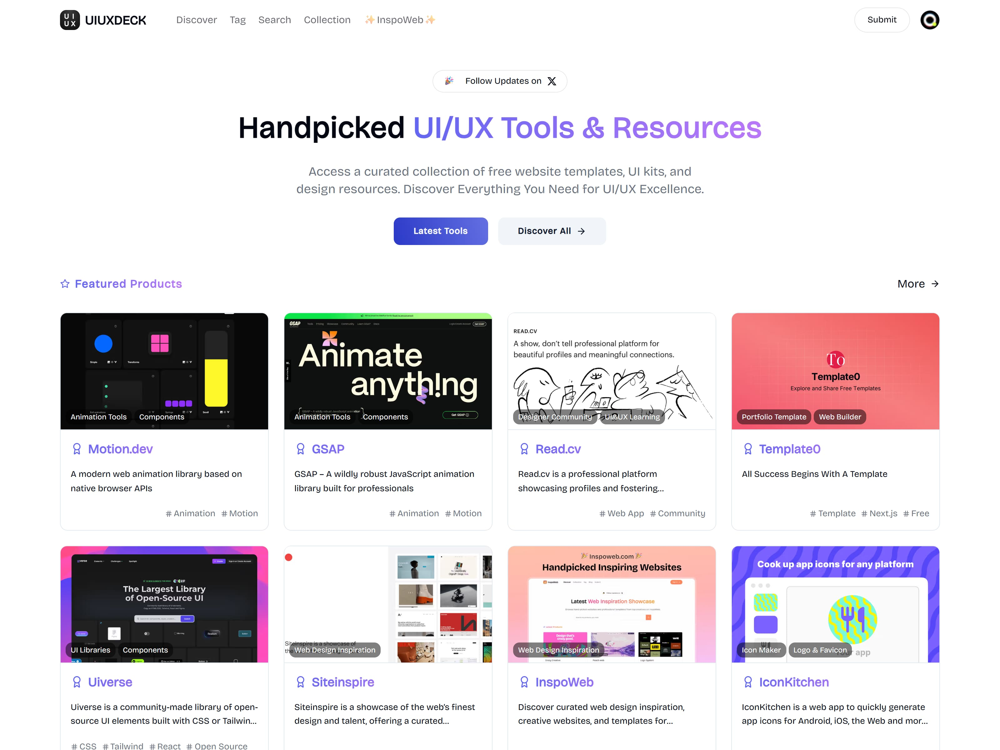

---

## 5. Personal Hub — 作品集与写作空间

Website: [lichenkang.dev](https://lichenkang.dev/)

Open Source: [github.com/lichenkang/personal-hub](https://github.com/lichenkang/personal-hub)

My personal site is both a showcase and a living notebook. The frontend is Astro, styles are powered by Tailwind + hometown-inspired typography, and content flows from a Spring Boot API so I can push articles straight from the CLI. I treat the site as a playground for micro-interactions—sticky cursors, scroll-based animations, and bilingual toggles—while keeping Lighthouse scores high.

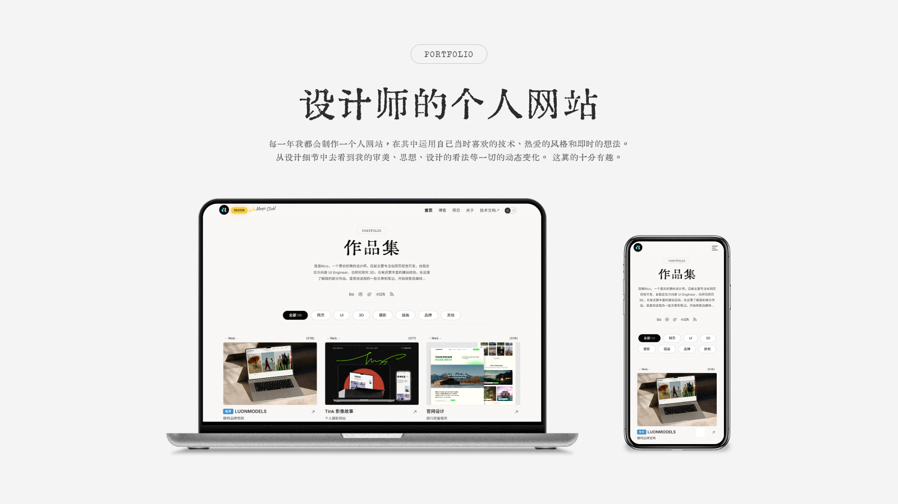

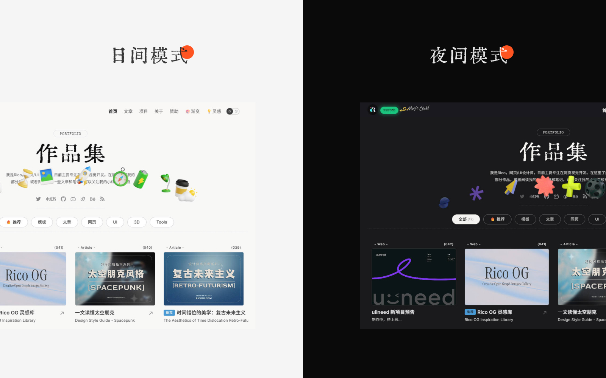

Every redesign teaches me something new about edge cases, caching, and storytelling pacing.

---

## 6. Nova Valentines 3D Pack

Landing Page: [nova.lichenkang.dev/valentines](https://nova.lichenkang.dev/valentines)

Nova Valentines began as a quick request from the campus media center: “我们想要一套统一的 3D 元素用在直播、推文和福利页。” I modelled the assets in Blender, exported GLB and PNG variants, and wrapped everything with an Astro landing page where people can download source files.

- Two Blender source files with warm/cool lighting rigs
- Figma preview files for quick layout experiments
- PNG renders (3000 x 3000) ready for marketing work

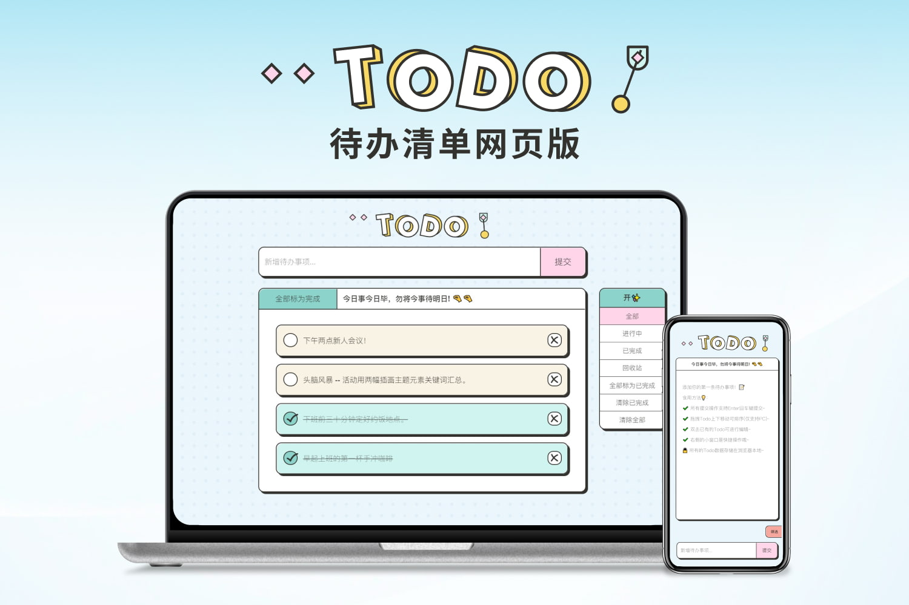

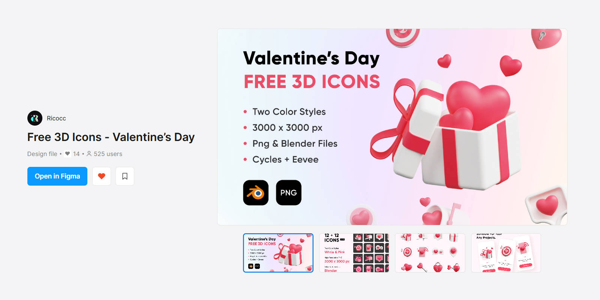

The repo is MIT licensed so clubs can remix the assets without legal overhead.

---

## Finally

The projects above cover task management, visualization, inspiration, content, and seasonal campaigns. They vary in difficulty, but every one of them started with a small friction point in my daily routine. When the tools I wanted didn't exist, I built them. That's the mindset I hope more students adopt when exploring development: focus on real needs, keep the scope honest, and iterate in public.

Designing and coding aren't separate silos to me—they're the same craft delivered through different materials. With AI coding assistants accelerating the boring parts, our product thinking and component mindset become even more valuable. Treat code like any other medium: learn what you need, when you need it, and use it to express ideas faster.

Reintroducing myself: I'm Li Chenkang, a Java-focused full-stack student dev who documents everything along the way. If any of these projects spark ideas, feel free to reach out—I'd love to jam on your build too.
